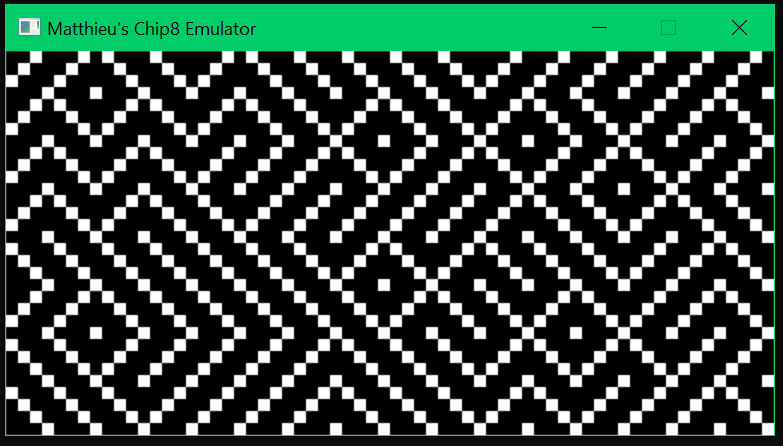
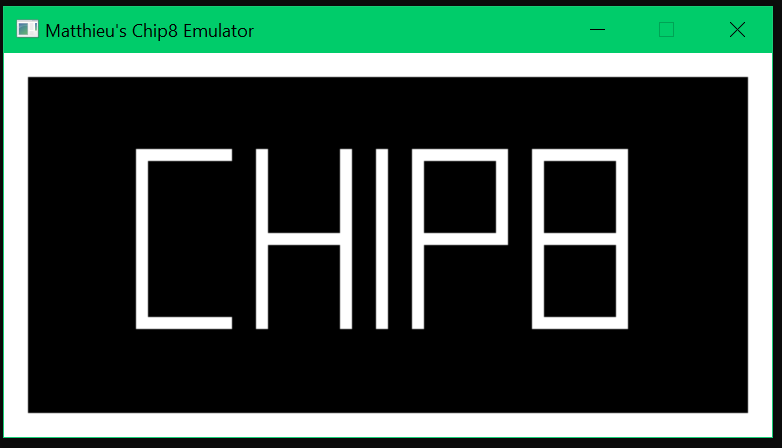

# Chip8 emulator 

- Specification I used : http://devernay.free.fr/hacks/chip8/C8TECH10.HTM#8xy4

- A tutorial I followed (not closely though) : https://zestedesavoir.com/tutoriels/1148/introduction-a-lemulation-console/

- SDL2 doc : https://wiki.libsdl.org/SDL2/APIByCategory

- Here are some screenshots : 

